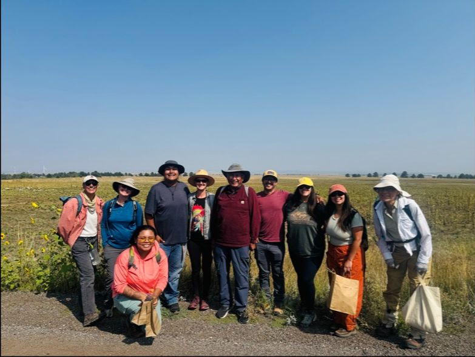

I am a PhD student at the University of Colorado at Boulder, working in the Living Matter Lab of Dr. Mirela Alistar in the ATLAS Institute. My work is interdisciplinary but the overall theme is **methodology development and validation when working with scarce data**. 

My research asks the question of **"When we want to learn about something that only has scarce data, how can we work with what we have to make something new?"**.

Before coming to Colorado, I completed my B.S. in Mathematics at the University of Maryland, Baltimore County and my A.S. degrees in Physics and Biology at Harford Community College.

I've had the pleasure of **working with the Colorado State Government**, being a [**2024-2025 Boulder Black Blossom**](https://www.colorado.edu/support/gar/current-graduate-students/boulder-black-blossoms#accordion-1131676925-1), and volunteering to review travel grants for [**SACNAS**] (https://www.sacnas.org/). 

Research Projects:
- Working with rare and novel viral proteins: "Characterizing network analysis architectures for Anti-CRISPR proteins - structural properties and implications as a data structure" - Michelle Ramsahoye and Mirela Alistar (in preparation)
- Online discourse about childhood experiences of the /r Guyana subreddit (started Oct 2025)
- SemEval 2025 Task 10: Psycholinguistic Conspiracy Marker Extraction and Detection (started Oct 2025)

### Seed Gathering 2025 with Harvest of All First Nations

Michelle with HAFN, Sept 2025 - [More information about Harvest of All First Nations](https://hafnco.org/)

### Socials
- [ATLAS Lab Page with my email](https://www.colorado.edu/atlas/michelle-ramsahoye)
- [LinkedIn](https://www.linkedin.com/in/michelleramsahoye/)
- [Bluesky](https://bsky.app/profile/lusnu.bsky.social)
- [Google Scholar](https://scholar.google.com/citations?user=pHODSSAAAAAJ&hl=en)

