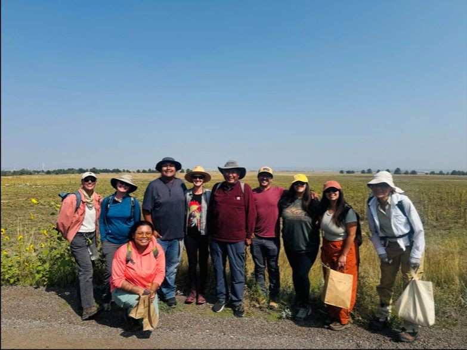
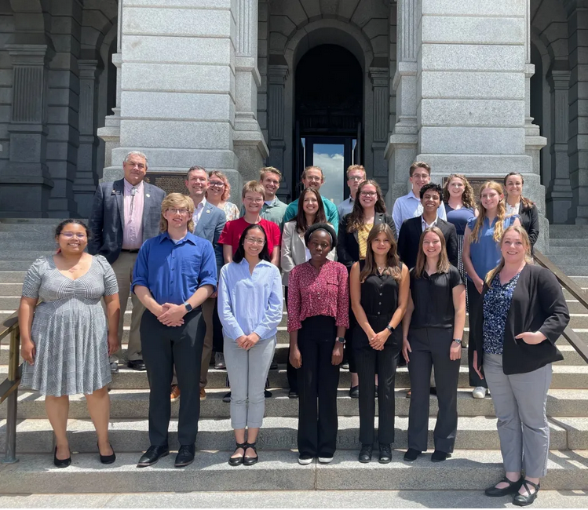

I am a 4th year PhD student at the University of Colorado at Boulder, working in the Living Matter Lab of Dr. Mirela Alistar in the ATLAS Institute. My work is interdisciplinary in application, but the overall theme is **methodology development and validation when working with scarce data**. My research often includes **data transformations** with **a focus on data quality and robustness of machine learning (ML) and natural language processing (NLP) tools**.

I find the steps of taking data and transforming it into input for a ML/NLP tool to consume to be fascinating. These representations are an attempt of simplifying things that may otherwise, be endlessly complex. I am always curious as to what information is lost, unaccounted for, or sometimes misconstrued within these transformations, and how it affects the output that we receive and then proceed to use (increasingly for way too many things, it seems). I believe it is only by thoroughly understanding the data can we approach (1) safer and more reliable applications of AI tools and we can (2) honestly come to terms with what these tools can and cannot do, and what place they should have within our lives.

My research asks the question of **"When we want to learn about something that only has scarce data, how can we work with what we have?"**. (It is important to note that I believe sometimes the answer is **"We can't! At least not with a ML/NLP tool."**). My work often skews towards being involved in computational biology, but I don't consider myself tied to any particular field.

Before coming to Colorado, I completed my B.S. in Mathematics at the University of Maryland, Baltimore County and my A.S. degrees in Physics and Biology at Harford Community College. **My CV is found at the bottom of the page.**

I've had the pleasure of **working with the Colorado State Government**, being a [**2024-2025 Boulder Black Blossom**](https://www.colorado.edu/support/gar/current-graduate-students/boulder-black-blossoms#accordion-1131676925-1), and volunteering to review travel grants for [**SACNAS**](https://www.sacnas.org/). I am also a current member of the CU Boulder Graduate Committee on AI in Research and Education.

Research Projects:
- Working with rare and novel viral proteins: "Revisiting graph-based approaches for small protein analysis: Insights from anti-CRISPR protein networks" - Michelle Ramsahoye and Mirela Alistar (working on revisions)
- Working with data transformations for latent topic modeling, using political discourse comments from the /r Guyana subreddit (started Oct 2025)

### Seed Gathering 2025 with Harvest of All First Nations

Michelle with HAFN, Sept 2025 - [More information about Harvest of All First Nations](https://hafnco.org/)

### Colorado Science and Engineering Policy Fellowship 2023

Michelle with CSEPF, Summer 2023 - [More information about CSEPF](https://csepf.org/)

### Socials
- [ATLAS Lab Page with my email](https://www.colorado.edu/atlas/michelle-ramsahoye)
- [LinkedIn](https://www.linkedin.com/in/michelleramsahoye/)
- [Bluesky](https://bsky.app/profile/lusnu.bsky.social)
- [Google Scholar](https://scholar.google.com/citations?user=pHODSSAAAAAJ&hl=en)

### CV (last updated 4/08/2026)
<embed src="images/CV_04_08_2026 (1).pdf" type="application/pdf" width="100%" height="800px">

